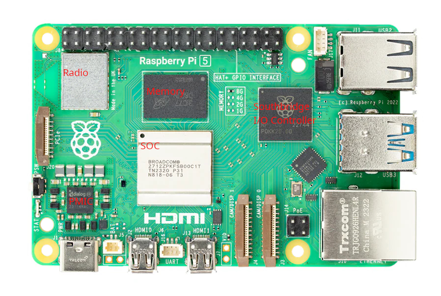

# raspberry-pi5-repair
Documentation/Resources for Repairing Raspberry PI 5

## Background
I recently purchased a known faulty Raspberry PI 5 from eBay as a DIY challenge to see if I could fix it. I 100% knew the risk I was taking. The seller described the situation as:

> The red power led goes on but does not post, boot, or even display anything on a monitor.

When I recieved the unit it was exactly as advertised -- Solid red light, not green activity light of any kind, no display, no boot, nadda...

As I debugged and researched things I found surprisingly little information available online for my situation. I ended up taking some notes, readings, screenshots, etc, so I figured I would dump them here in case it helps others.

## Diagrams/Images/Etc

### Test Pin Map
Perhaps the most useful resource I've found to date was the test pin map from https://repair.wiki/w/Raspberry_Pi - https://repair.wiki/images/2/2e/RPi_5_Test_point_map.jpg

### PMIC Voltages
While chasing power readings, I took the following measurements. I do *not* have a working PI 5 to compare, so what you see here are the readings I get on my broken board, this is not an image of what it should look like. I believe some of these 0v reading should actually be 3.3v

### Chips & Components
I would have expected a more comprehensive "map" of the various chips and components to exist, but I didn't find one so I started to piece one together myself.

