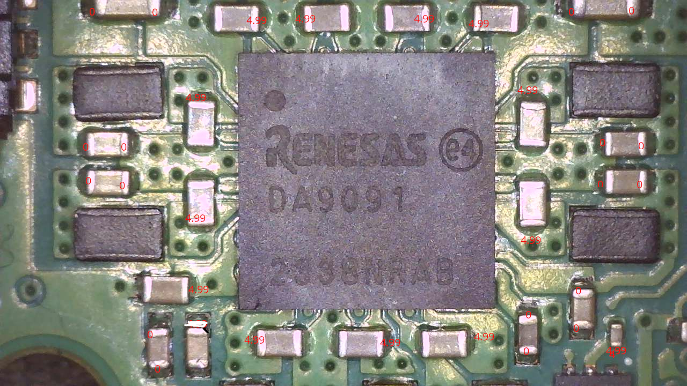
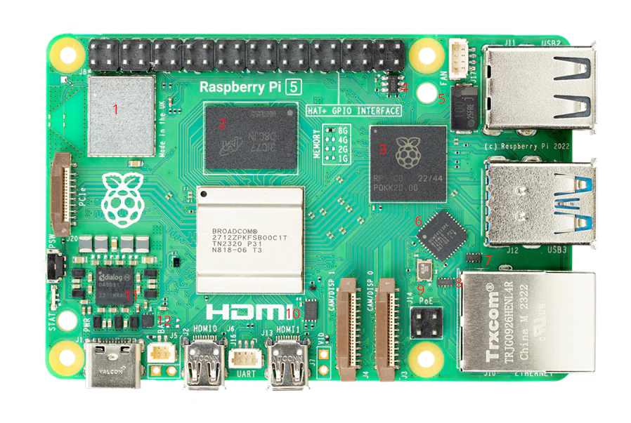

# raspberry-pi5-repair
Documentation/Resources for Repairing Raspberry PI 5

## Background
I recently purchased a known faulty Raspberry PI 5 from eBay as a DIY challenge to see if I could fix it. I 100% knew the risk I was taking. The seller described the situation as:

> The red power led goes on but does not post, boot, or even display anything on a monitor.

When I recieved the unit it was exactly as advertised -- Solid red light, not green activity light of any kind, no display, no boot, nadda...

As I debugged and researched things I found surprisingly little information available online for my situation. I ended up taking some notes, readings, screenshots, etc, so I figured I would dump them here in case it helps others.

## Troubleshooting

Online resources suggested to use the Raspberry PI Imager to install a new bootloader, so that was attempted, but was unsuccesful.

Online resources also suggested to try USB or Network booting. Both were attempted without success.

Digging deeper, I tested voltages on the various GPIO pins and found that 5v pins had voltage but none of the 3v pins had any voltage. This led to series of voltage probe all around the board (See the test pin map below). This exercise, and lots of research lead me to believe PMIC chip might be faulty. The PI 5 uses a DA9091 chip which can only be source from a single location currently, [PI Hut in the UK](https://thepihut.com/products/da9091-pmic-5-pack). The chips themselves are pretty cheap however shipping to the US is kind of steep, and I'm not positive that chip is the problem. I struggled to find any resources to help me confirm or disprove my theory. The chip itself is an SMD, not through hole component and while I'm fairly comfortable through-hole and larger SMDs, I don't have a hot air station (yet) so swapping out this chip is a little beyond my current tools and skillset. Combine that with the price of the chip and lack of confidence and I've paused my efforts on this board for now. I do plan on getting a hot air station, so when I do, after some practice, I might revisit trying to replace this chip.

## Diagrams/Images/Etc

### Test Pin Map
Perhaps the most useful resource I've found to date was the test pin map from https://repair.wiki/w/Raspberry_Pi - https://repair.wiki/images/2/2e/RPi_5_Test_point_map.jpg

### PMIC Voltages
While chasing power readings, I took the following measurements. I do *not* have a working PI 5 to compare, so what you see here are the readings I get on my broken board, this is not an image of what it should look like. I believe some of these 0v reading should actually be 3.3v

### Chips & Components
I would have expected a more comprehensive "map" of the various chips and components to exist, but I didn't find one so I started to piece one together myself.

1. Radio
2. Memory
3. Southbridge I/O Controller
4. AP22652W6-7 LOAD SWITCH
   * Description: The AP22652, AP22653, AP22652A, and AP22653A are single-channel, precision-adjustable, current-limited
     switches optimized for applications that require precision current limiting, or to provide up to 2.1A of continuous
     load current during heavy loads/short circuits.
   * References:
     * https://forums.raspberrypi.com/viewtopic.php?t=397399#p2370772
     * Datasheet: https://www.diodes.com/datasheet/download/AP22652_AP22653_AP22652A_AP22653A.pdf
     * Digikey: https://www.digikey.co.uk/en/products/detail/diodes-incorporated/AP22652W6-7/10481161
6. TBD
7. TBD
8. TBD
9. TBD
10. TBD
11. TBD
12. PMIC
13. TBD
14. SOC
